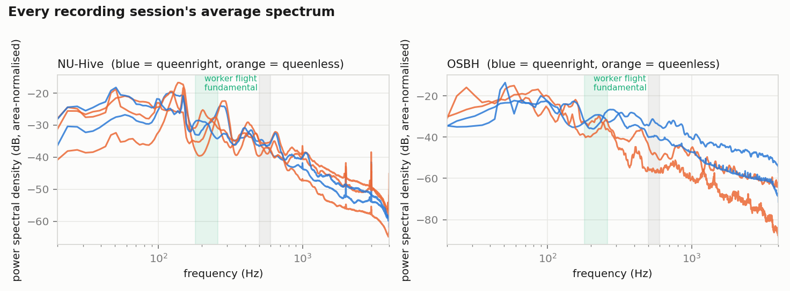
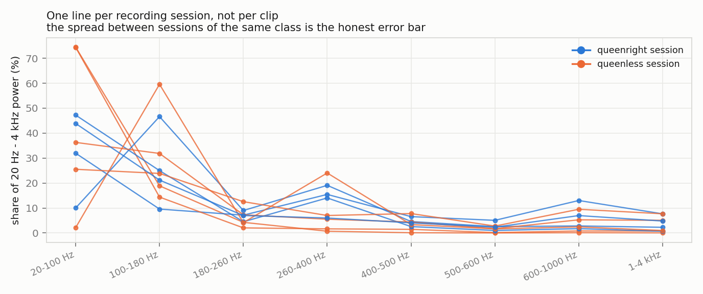
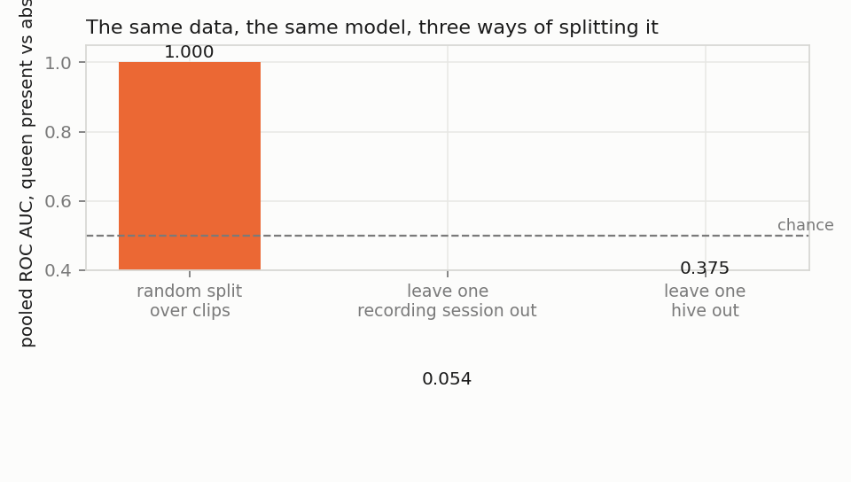
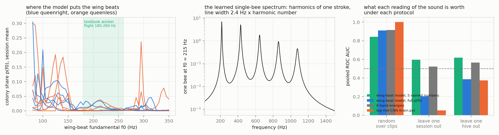

# Is the queen there? What hive sound can and cannot say

A queenless colony has weeks to live, and beekeepers have long said they
can hear it. Published classifiers agree, with accuracies in the high
nineties. This repository asks a narrower question. Someone who wants to put
a microphone in *their* hive needs to know whether any of that survives a
colony the model has never heard.

Three readings of the same recordings go through the same three tests. The
first is a log-mel convolutional network, which is what the literature uses.
The second is eight band energies, which is what a beekeeper's chart shows.
The third is a **physical model of the hum built from wing beats**. That model
can only explain a spectrum through the harmonics of a wing stroke. It
returns per-clip quantities that have a physical meaning: the colony's
wing-beat frequency, its spread, and the share of the sound that is bees at
all.

---

## 1. The recordings

Inês Nolasco and Emmanouil Benetos, *To bee or not to bee: an annotated
dataset for beehive sound recognition* (Zenodo 1321278, CC BY 4.0). There
are two sources, and the difference between them is the whole design:

| source | hives | sessions | what a label is |
|---|---|---|---|
| NU-Hive | 2 (Hive1, Hive3) | 5 | the same hive recorded on separate days with the queen present and after she was removed |
| Open Source Beehives | 4 citizen-science hives | 4 | one hive, one state: *Active* or *Missing Queen* |

Every file carries an annotation of which seconds are hive sound and which
are a passing car or a voice. Only the hive-sound seconds are used, cut into
two-second clips at 8 kHz. That gives 56 files, 10 277 clips and 5.7 hours.
After capping each session at 600 clips, so that no single afternoon
dominates, 4 301 clips remain.

Nine sessions, six hives. That is the true sample size for any claim about
queens, and every number below should be read with it in mind.

---

## 2. Findings at a glance

| # | Finding | Evidence |
|---|---------|----------|
| 1 | Two thirds to four fifths of a hive's acoustic energy is below 260 Hz, and the sessions of one class differ from each other by more than the classes differ. The textbook 180-260 Hz "worker flight" band holds 7 % of the power in queenright and 6 % in queenless sessions. | section 3 |
| 2 | **A random split over clips gives AUC 0.9999.** The same network, asked about a session it has not heard, gives **0.05**; about a hive it has not heard, **0.38**. Below chance is not noise. The network learned to recognise sessions, and the nearest session usually has the other label. | section 4 |
| 3 | The hum is well described as a harmonic comb - a learned single-bee spectrum with a 2.4 Hz line width that widens with harmonic number. But the model places most of the colony's fundamental at 100-160 Hz, not at the textbook 200-250 Hz. Either these recordings hum lower than the literature says, or the model is reading something periodic that is not a bee (see below). | section 5 |
| 4 | Five named quantities from the wing-beat model transfer where the network does not: AUC **0.60** across sessions and **0.62** across hives, against 0.52 / 0.57 for band energies. That is above chance and nowhere near a product. | section 5 |
| 5 | The full wing-beat distribution p(f0), fed to the same regression, does worse than chance across sessions (0.20). Fifty-five numbers per clip are enough to learn session identity again. The physics helps only when it is reduced to the few quantities that mean something. | section 5 |

---

## 3. What a hive sounds like



One curve per recording session, area-normalised, blue queenright and orange
queenless. Two things are visible before any model is fitted. The energy is
low: most of it sits under 260 Hz. The shape of the spectrum differs between
the two projects (different microphones, boxes and countries) more than
between the two queen states. And within a project, the two queenless
sessions of Hive3 do not look more like each other than either looks like the
queenright session.



These are the bands the literature names, one line per session. The thing
being replicated is the session, not the clip. Ten thousand two-second clips
from one afternoon in one hive are one observation of one colony. Treating
them as independent is how a difference between two recordings becomes a
p-value with ten zeros in it. Read that way, no band separates the classes
by more than the spread within a class. The 500-600 Hz "swarming band" holds
2.7 % versus 1.3 % - a difference, with a standard deviation across sessions
of 1.5 and 1.0.

Because there are only nine sessions, "larger than the spread" can be made
exact. Four queenright labels among nine sessions can be handed out in
C(9, 4) = 126 ways. So every relabelling is enumerated and the observed gap
between class means is placed among all 126 (`src/band_permutation.py`,
`results/band_permutation.json`). The smallest two-sided p-value nine
sessions can produce is 1/126 = 0.008. No band comes close:

| band | queenright | queenless | session AUC | exact p | p without CF001 |
|---|---|---|---|---|---|
| 20-100 Hz | 0.33 | 0.43 | 0.45 | 0.61 | 0.94 |
| 100-180 Hz | 0.26 | 0.30 | 0.45 | 0.71 | 0.57 |
| 180-260 Hz (worker flight) | 0.069 | 0.061 | 0.65 | 0.76 | 0.91 |
| 260-400 Hz | 0.136 | 0.078 | 0.75 | 0.32 | 0.51 |
| 400-500 Hz | 0.044 | 0.034 | 0.65 | 0.56 | 0.91 |
| 500-600 Hz (swarming) | 0.027 | 0.013 | 0.75 | 0.18 | 0.34 |
| 600-1000 Hz | 0.061 | 0.036 | 0.70 | 0.44 | 0.63 |
| 1-4 kHz | 0.039 | 0.029 | 0.55 | 0.68 | 1.00 |

Values are shares of session power. Session AUC is the fraction of the
twenty queenright/queenless session pairs in which the queenright session
has the larger share. The last column drops CF001, a queenless session that
contributes six clips yet carries the same weight as a 1 200-clip session in
every session-level mean on this page. The 20-100 Hz gap, the largest in the
table, is mostly that one session. The swarming band, the best of the eight,
sits at p = 0.18 with all sessions and 0.34 without it. That is the same
finding as above, now with a number on it.

---

## 4. Three ways to split the data



A small convolutional network on log-mel spectrograms, with a filterbank
that starts at 20 Hz so the low band is not discarded by a default. It is
trained the same way three times:

- **random** - five stratified folds over clips. Clips from the same
  ten-minute file land on both sides. This is how most published results are
  produced.
- **session** - leave one recording session out.
- **hive** - leave one hive out. This is the only protocol that answers the
  question a beekeeper asks.

Folds under the last two often contain a single class, so out-of-fold scores
are pooled and scored once.

| protocol | pooled AUC | balanced accuracy |
|---|---|---|
| random over clips | **0.9999** | 0.995 |
| leave one session out | **0.054** | 0.14 |
| leave one hive out | **0.375** | 0.39 |

The random number is real and means nothing. It measures whether the network
can tell which recording a clip came from. The session number is the
instructive one. An AUC of 0.05 is not a model that knows nothing. It is a
model that confidently assigns each new session the label of the session it
most resembles, and in this dataset the nearest session usually has the
other label (Hive1's two days, Hive3's three). A model that had learned
*queens* would sit near 0.5 on a held-out session at worst. This one learned
*sessions*, and it says so.

---

## 5. A physical model of the hum



A hive sounds the way it does because tens of thousands of bees beat their
wings. Each bee is a periodic source: a stroke at a fundamental f0 that moves
with the bee's size, load and temperature. A periodic source has harmonics.
The colony spectrum is written as that superposition and nothing else:

    S(f) = g * [ sum_k p(f0_k) sum_h a(h, f0_k) L(f; h*f0_k, h*gamma)  +  B(f) ]

Here p(f0) is the distribution of wing-beat frequencies in the colony, a
55-point histogram from 80 to 350 Hz, one per clip. The harmonic profile of a
stroke, a(h, f0), is a small network of harmonic number and fundamental,
shared by every clip. L is a Lorentzian line whose width grows with harmonic
number. B(f) is a power-law background per clip for everything that is not a
wing beat. The model is fitted to the spectra alone, by log-spectral error.
**The queen label never enters the fit.** Under the session and hive
protocols the shared physics (line width, harmonic profile) is refitted on
the training sessions only and frozen before the held-out clips are
decomposed.

**What the fit finds.** A single-bee spectrum with a line width of 2.4 Hz at
the fundamental, and a harmonic profile that decays over five harmonics. The
learned colony distributions put most of the mass at 100-160 Hz, with the
textbook 180-260 Hz band nearly empty in every session. Where the mass sits
differs by session far more than by class. The queenless sessions include
one at 104 Hz and, on six clips, one at 245 Hz.

**What the quantities are worth.** Five values per clip go into a logistic
regression under the same three protocols: mean and spread of f0, share of
power in the comb, background slope and level. They are compared with the
eight band energies and with the network:

| reading of the sound | random | session | hive |
|---|---|---|---|
| log-mel CNN | 0.9999 | 0.054 | 0.375 |
| 8 band energies + logistic regression | 0.915 | 0.522 | 0.566 |
| wing-beat model, full p(f0) (55 numbers) | 0.909 | 0.203 | 0.387 |
| **wing-beat model, 5 named quantities** | 0.842 | **0.595** | **0.618** |

The pattern is the same in every row. The more freedom a reading has, the
better it does on the random split and the worse it does on a new colony.
The network is best on clips it has effectively seen and worst on colonies
it has not. The full wing-beat histogram, 55 numbers per clip, is enough to
identify sessions again and falls to 0.20. Only the five quantities with
physical names stay above chance on a new session (0.60) and a new hive
(0.62). That is modest, it rests on nine sessions, and it is not enough to
act on.

**The caveat that matters.** The model knows what a harmonic series looks
like. It does not know what a bee is. Any periodic source in the recording
is decomposed into "bees" at whatever fundamental fits: mains hum at 50 or
60 Hz and its harmonics, a fan, a compressor in the citizen-science
recordings. The mass at 100 and 150 Hz in several sessions is exactly where
the harmonics of a 50 Hz mains would sit. This is the same lesson as
section 4 in a different coat. The decomposition is only as good as the
recording. A physical model at least makes that failure visible - a
distribution parked at mains harmonics can be seen in the left panel - where
a spectrogram network hides it.

---

## 6. Checks that pass

Eight checks, all passing:

- the queen label, hive and session are parsed from every file-name
  pattern in the dataset, and documentation files are rejected
- only segments annotated as hive sound are kept; a comma decimal is read
  correctly
- the mel filterbank covers every frequency from 40 Hz up, so the band
  where hive sound lives is not silently discarded
- a single bee in the wing-beat model produces peaks at f0, 2f0, 3f0, 4f0
  and nowhere else
- the line width at the third harmonic is three times the width at the
  first
- a colony placed entirely at 250 Hz is read back as f0 = 250 Hz with zero
  spread
- **the result is pinned**: the random-split AUC must exceed 0.99, the
  network's session and hive AUCs must be below 0.5, and the five wing-beat
  quantities must land between 0.5 and 0.8 on both leave-out protocols. The
  page is not allowed to claim a working detector.
- **no band separates the classes**: the exact permutation test over the
  126 relabellings of nine sessions returns p > 0.1 for every band, with
  and without the six-clip session. The estimator itself returns 1/126 on a
  perfectly separated case.

---

## 7. Limits of the evidence

- **Nine sessions from six hives.** Every cross-colony number above has a
  sample size of six, not four thousand. The 0.60 / 0.62 could be 0.5 on the
  next six hives.
- **Two recording projects, two microphones, two countries.** Part of what
  separates sessions is equipment. A dataset with one microphone in twenty
  hives would answer the hive question far better than this one can.
- **Queen removal is not the only thing that changed** between the NU-Hive
  sessions. Date, weather, time of day and forage did too. The label is the
  queen; the sound is everything.
- **The wing-beat model is a spectral model, not a bee counter.** It cannot
  tell a bee from any other periodic source, and it does not model the
  box, which shapes the spectrum below 300 Hz.
- **No swarming, no disease, no robbing.** The dataset labels one state.

---

## 8. Notes from the build

This started as a dormant folder called `beehive-acoustics`. The code was
written on 7 September, the download stopped half way, and nothing was ever
analysed. Fetching the rest of the raw audio (3.7 GB) from Zenodo only
worked with resumable `curl -C -` and retries. The finished version, with
the wing-beat model added, went public on 12 September. The exact
permutation test in section 3 and the eighth check came later the same day.
Until then the band claim rested on eyeballing the spread.

Two things I would not call finished. The global fit of the wing-beat model
reaches a log-spectral RMSE of 0.60 after 1 500 Adam steps, which is
mediocre. And the mains-harmonic problem in section 5 is stated, not
handled. Notching or masking the 50 Hz harmonics before the fit, and running
more steps, are the obvious next moves. For scale, `train.py` takes about
25 minutes on Apple silicon and `wingbeat_pinn.py` about 20 minutes on a
laptop CPU.

---

## 9. Code and how to run it

The physics core is public in this repository:

- `src/prepare.py` - the recordings to labelled clips, with provenance
- `src/spectra.py` - session-level spectra and the band table
- `src/model.py` - the log-mel front end (filterbank written out) and the
  network
- `src/train.py` - the three protocols, pooled scoring, resumable
- `src/band_permutation.py` - the exact permutation test on the session
  band table (standard library only)
- `src/wingbeat_pinn.py` - the wing-beat mixture model, its named features,
  and the protocol comparison
- `tests/test_all.py` - the eight checks above

`results/` holds every number on this page as JSON. `data/SOURCE.md` says
how to fetch the recordings; they are not redistributed here.

```
pip install -r requirements.txt
python src/download.py && python src/prepare.py
python src/spectra.py && python src/band_permutation.py
python src/train.py                               # ~25 min on Apple silicon
python src/wingbeat_pinn.py                       # ~20 min on a laptop CPU
python src/figures.py && python tests/test_all.py
```

---

## 10. Licence and dataset credit

Documentation, figures and result files: CC BY 4.0. Source code in `src/`
and `tests/`: MIT.

The recordings belong to their authors and are distributed through Zenodo
under CC BY 4.0. Cite them, not this page:

- Inês Nolasco, Emmanouil Benetos. 2018. *To bee or not to bee: An annotated
  dataset for beehive sound recognition.* Zenodo, doi:10.5281/zenodo.1321278.
  Recordings from the NU-Hive project and the Open Source Beehives project.

---

*Other acoustic projects built on the same physics-first approach are listed
on the profile [README](https://github.com/drdmitrymikhaylov).*
